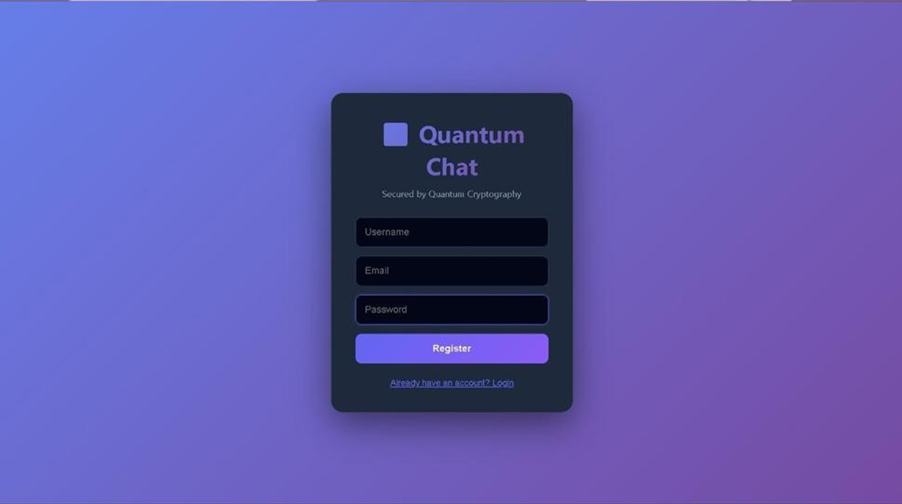
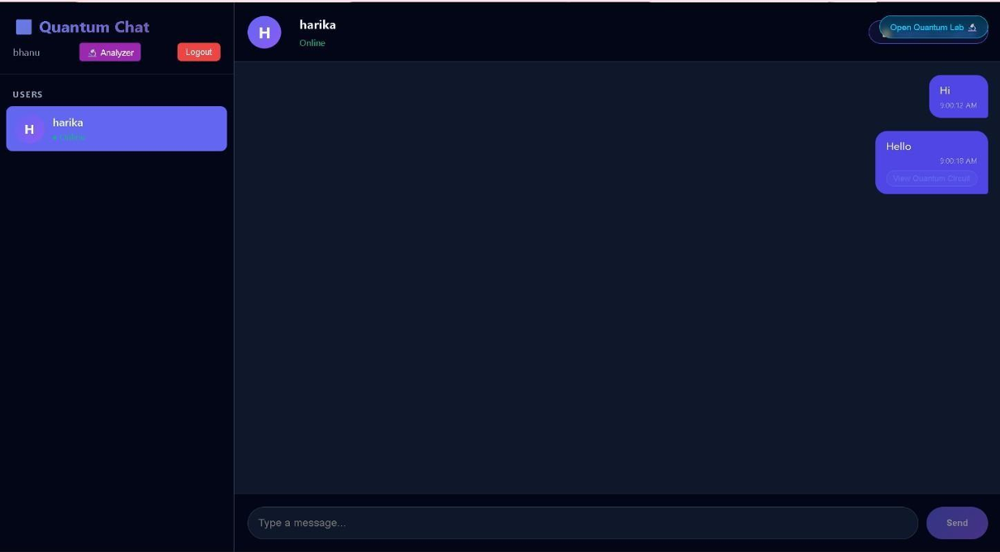
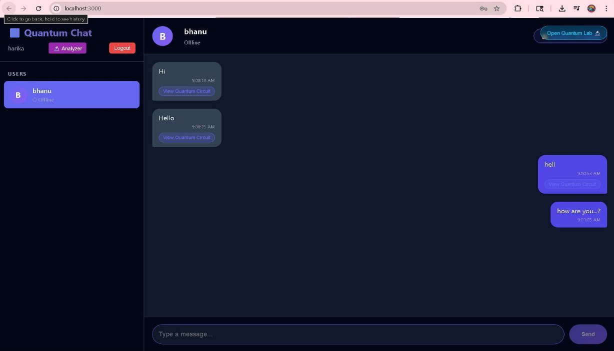
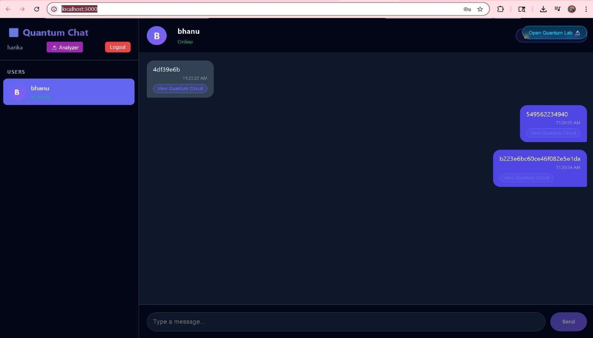
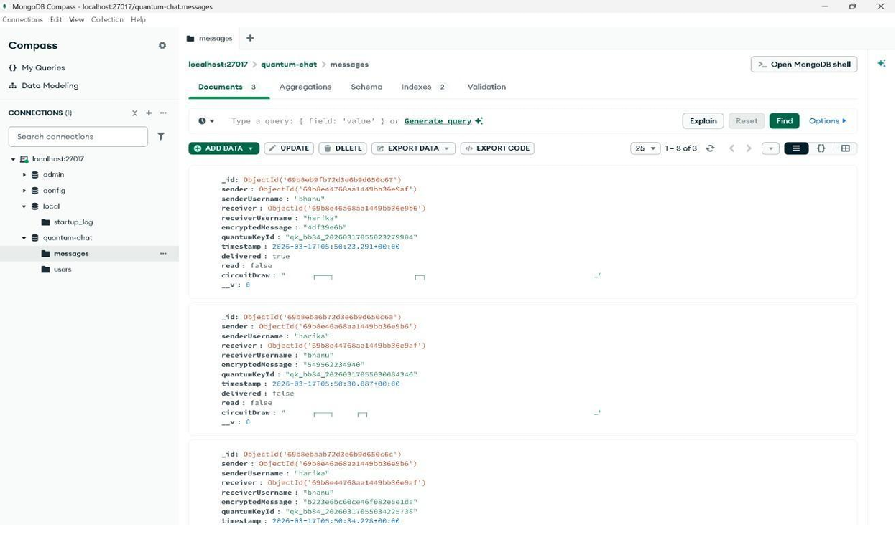
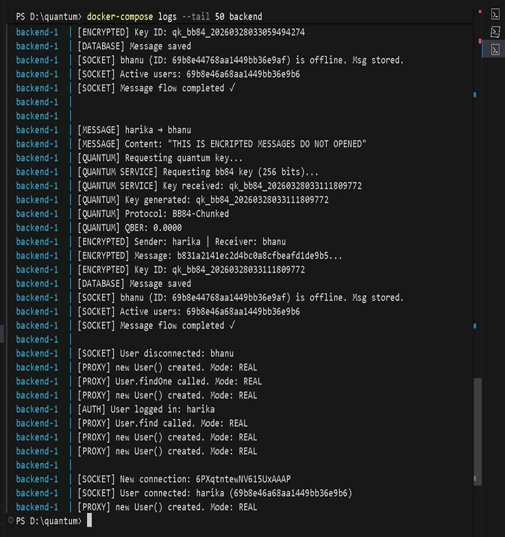

# 🔐 Quantum Secure Chat System

**A full-stack real-time messaging platform combining classical cryptography with quantum cryptography concepts to demonstrate secure communication and future quantum threats.**

[](https://www.python.org/)
[](https://www.ibm.com/quantum/qiskit)
[](https://en.wikipedia.org/wiki/Advanced_Encryption_Standard)
[](https://en.wikipedia.org/wiki/RSA_%28cryptosystem%29)
[](https://en.wikipedia.org/wiki/BB84)
[](https://developer.mozilla.org/en-US/docs/Web/API/WebSockets_API)
[](https://www.docker.com/)

---

## 📌 Project Overview

**Quantum Secure Chat System** is a full-stack academic project designed to demonstrate how classical cryptography and quantum cryptography concepts can be combined to improve secure communication.

The system provides a real-time chat environment where messages are protected using **AES encryption**, keys can be exchanged using **RSA**, and a **BB84 Quantum Key Distribution (QKD) simulation** demonstrates how quantum principles can be used for secure key generation and eavesdropping detection.

The project also includes a **Shor's Algorithm demonstration using Qiskit** to illustrate how sufficiently powerful quantum computers could threaten traditional public-key cryptography such as RSA.

### Core Concept

```text
                    QUANTUM SECURE CHAT
                           │
             ┌─────────────┴─────────────┐
             │                           │
       Classical Security          Quantum Security
             │                           │
        ┌────┴────┐                  ┌───┴────┐
        │         │                  │        │
       AES       RSA                BB84    Shor's
        │         │                  │        │
   Message      Key                Secure   RSA Attack
  Encryption   Exchange           Key QKD  Simulation
```

---

## ✨ Key Features

### 🔐 Secure Authentication

* User login system
* User-based chat sessions
* Protected communication interface
* Secure access to chat functionality

### 💬 Real-Time Chat

* Real-time message communication
* Bi-directional message synchronization
* User-to-user messaging
* WebSocket-based communication
* Designed for low-latency communication

### 🔒 AES Encryption

* AES-based message encryption
* Protects chat messages from unauthorized access
* Provides symmetric encryption for message payloads
* Supports the hybrid cryptographic architecture

### 🔑 RSA Key Exchange

* RSA-based public-key cryptography
* Demonstrates secure key exchange
* Shows the role of classical public-key cryptography in secure communication
* Used to demonstrate the limitations of RSA against future quantum computers

### ⚛️ BB84 Quantum Key Distribution

The project includes a simulation of the **BB84 Quantum Key Distribution protocol**.

The BB84 component demonstrates:

* Quantum basis selection
* Key generation
* Photon/polarization concepts
* Basis comparison
* Secret-key extraction
* Eavesdropping detection

The project uses BB84 as a quantum-inspired secure key exchange mechanism.

### ⚡ Shor's Algorithm Demonstration

The project demonstrates the security threat posed by quantum computing to RSA.

Using **Qiskit**, the system demonstrates the basic concept of factoring a number using Shor's Algorithm.

For the demonstration:

```text
n = 15
a = 2
Period r = 4

gcd(2^(4/2) - 1, 15) = 3
gcd(2^(4/2) + 1, 15) = 5

Result:
15 = 3 × 5
```

This illustrates why sufficiently capable quantum computers could threaten RSA-based cryptography.

### 🧪 Security Attack Simulation

The project includes a demonstration area for:

* Encrypted messages
* Database storage
* Attempted message analysis
* RSA vulnerability demonstration
* Shor's Algorithm simulation

---

# 🖥️ Screenshots

> Screenshots of the Quantum Secure Chat System demonstrating authentication, secure communication, encryption, and quantum security concepts.

## 🔐 Login



---

## 👤 Person 1



---

## 👤 Person 2



---

## 🗄️ Secure Communication Between the Users



---

## 🔒 Encrypted Messages



---

## ⚛️ Shor's Algorithm / RSA Attack Simulation



---

# 🛠️ Technology Stack

| Technology     | Purpose                                                |
| -------------- | ------------------------------------------------------ |
| **Python**     | Backend programming and application logic              |
| **Qiskit**     | Quantum computing and Shor's Algorithm simulation      |
| **AES-256**    | Symmetric message encryption                           |
| **RSA**        | Public-key cryptography and key exchange demonstration |
| **BB84 QKD**   | Quantum Key Distribution simulation                    |
| **WebSockets** | Real-time communication                                |
| **HTML5**      | Web page structure                                     |
| **CSS3**       | User interface styling                                 |
| **JavaScript** | Client-side functionality                              |
| **Docker**     | Containerized application deployment                   |
| **Git/GitHub** | Version control and source-code management             |

The project's documented technology stack includes Python, Qiskit, AES-256, RSA, WebSockets and BB84 QKD.

---

# 🏗️ System Architecture

```text
                         ┌──────────────────────┐
                         │       Client         │
                         │  HTML / CSS / JS     │
                         └──────────┬───────────┘
                                    │
                                    ▼
                         ┌──────────────────────┐
                         │   Real-Time Chat     │
                         │     WebSockets       │
                         └──────────┬───────────┘
                                    │
                     ┌──────────────┴──────────────┐
                     │                             │
                     ▼                             ▼
          ┌──────────────────┐          ┌──────────────────┐
          │ Classical Crypto │          │ Quantum Security │
          └────────┬─────────┘          └────────┬─────────┘
                   │                             │
             ┌─────┴─────┐                 ┌─────┴─────┐
             │           │                 │           │
            AES         RSA               BB84       Qiskit
             │           │                 │           │
             │      Key Exchange           │      Shor's
             │                             │     Algorithm
             └──────────────┬──────────────┘
                            │
                            ▼
                   ┌─────────────────┐
                   │ Secure Messages │
                   └─────────────────┘
```

---

# 🔄 Project Workflow

```text
User Login
    │
    ▼
Select Chat User
    │
    ▼
Generate / Exchange Secure Key
    │
    ├──────────────► RSA
    │
    └──────────────► BB84 QKD Simulation
                         │
                         ▼
                    Secure Key
                         │
                         ▼
                   AES Encryption
                         │
                         ▼
                    Send Message
                         │
                         ▼
                    WebSocket
                         │
                         ▼
                  Receiving User
                         │
                         ▼
                  AES Decryption
                         │
                         ▼
                  Original Message
```

---

# ⚛️ BB84 Quantum Key Distribution

The BB84 protocol is used to demonstrate quantum key distribution.

### Basic Process

```text
Alice
  │
  │ Random bits + random bases
  ▼
Quantum Channel
  │
  │ Possible interception
  ▼
Bob
  │
  │ Measures using random bases
  ▼
Compare Bases
  │
  ▼
Discard Different Bases
  │
  ▼
Generate Shared Secret Key
```

The project demonstrates BB84 as a mechanism for generating secure keys and detecting potential eavesdropping.

---

# 🔐 Hybrid Encryption Model

The project combines multiple cryptographic techniques.

### Message Security

```text
Original Message
       │
       ▼
   AES Encryption
       │
       ▼
Encrypted Message
       │
       ▼
Secure Communication
       │
       ▼
AES Decryption
       │
       ▼
Original Message
```

### Key Security

```text
           Secure Key
               │
       ┌───────┴───────┐
       │               │
      RSA             BB84
       │               │
Classical Key     Quantum Key
 Exchange           Simulation
```

The hybrid approach combines the strong symmetric encryption of AES with classical and quantum-inspired key exchange concepts.

---

# ⚠️ RSA vs Quantum Computing

RSA is widely used in classical public-key cryptography, but a sufficiently powerful quantum computer running Shor's Algorithm could factor large integers efficiently.

This project demonstrates the concept using a small example:

```text
RSA / Integer
     │
     ▼
Shor's Algorithm
     │
     ▼
Quantum Period Finding
     │
     ▼
Factorization
     │
     ▼
RSA Vulnerability Demonstration
```

For the project demonstration:

```text
n = 15

15 = 3 × 5
```

The project uses this small example to demonstrate the principle rather than claiming that modern RSA keys can be practically broken by the current simulator.

---

# 🧪 Security Demonstration

The project demonstrates several security scenarios:

| Security Component   | Demonstration                       |
| -------------------- | ----------------------------------- |
| **AES**              | Message encryption                  |
| **RSA**              | Classical key exchange              |
| **BB84**             | Quantum key distribution simulation |
| **Shor's Algorithm** | RSA vulnerability demonstration     |
| **WebSockets**       | Real-time communication             |
| **Database**         | Message/user data management        |

The project presentation specifically identifies login, two users, database interaction, and attempts to analyze encrypted messages as part of the demonstrated system flow.

---

# 📋 Project Objectives

### Secure Chat Design

* Build a real-time chat application
* Provide private communication between users
* Protect messages using encryption

### BB84 Implementation

* Simulate Quantum Key Distribution
* Generate secure shared keys
* Demonstrate eavesdropping detection

### AES Encryption

* Encrypt messages before transmission
* Prevent unauthorized access to message content

### Shor's Algorithm

* Demonstrate quantum factoring
* Explain the future threat to RSA
* Show why post-quantum cryptography is important

### Deployment

* Support containerized deployment using Docker
* Make the project easier to run and manage

These objectives are documented in the project's presentation.

---

# 📂 Recommended Repository Structure

```text
quantum-whatsapp-clone/
│
├── Screenshots/
│   ├── login.png
│   ├── user1.png
│   ├── user2.png
│   ├── database.png
│   ├── encrypted-message.png
│   └── shor-algorithm.png
│
├── src/
│   └── ...
│
├── README.md
├── requirements.txt
├── Dockerfile
├── docker-compose.yml
└── Q-CHAT-DOCUMENTATION.docx
```

---

# 🚀 Installation & Setup

## 1. Clone the Repository

```bash
git clone https://github.com/yaswanthreddy7324/quantum-whatsapp-clone.git
```

```bash
cd quantum-whatsapp-clone
```

## 2. Create a Virtual Environment

### Windows

```bash
python -m venv venv
```

Activate it:

```bash
venv\Scripts\activate
```

### Linux / macOS

```bash
python3 -m venv venv
```

```bash
source venv/bin/activate
```

## 3. Install Dependencies

```bash
pip install -r requirements.txt
```

## 4. Run the Application

Use the project's main Python entry point, for example:

```bash
python app.py
```

> If your project uses a different entry file, replace `app.py` with the correct filename.

---

# 🐳 Docker Deployment

If Docker configuration is included in the repository:

```bash
docker build -t quantum-secure-chat .
```

Run the container:

```bash
docker run -p 5000:5000 quantum-secure-chat
```

Docker deployment is one of the documented objectives of the project.

---

# 🎯 Learning Outcomes

Through this project, the following concepts were explored:

* Python full-stack development
* Real-time WebSocket communication
* Symmetric cryptography
* Public-key cryptography
* AES encryption
* RSA cryptography
* Quantum Key Distribution
* BB84 protocol
* Quantum computing concepts
* Qiskit
* Shor's Algorithm
* Cryptographic vulnerabilities
* Database integration
* Docker deployment
* Git and GitHub

---

# 🔮 Future Enhancements

The project can be further improved by:

* Implementing true end-to-end encryption
* Integrating modern post-quantum cryptographic algorithms
* Replacing or supplementing RSA with quantum-resistant algorithms
* Implementing production-grade BB84/QKD infrastructure
* Adding stronger identity verification
* Adding secure key rotation
* Improving message integrity and authentication
* Deploying the system to a cloud environment
* Adding mobile support
* Implementing comprehensive security testing

True end-to-end encryption and integration of post-quantum cryptographic algorithms are identified as important future improvements in the project material.

---

# 📊 Existing vs Proposed System

| Feature                      | Traditional Chat System | Quantum Secure Chat |
| ---------------------------- | ----------------------- | ------------------- |
| Real-Time Messaging          | ✅                       | ✅                   |
| Classical Encryption         | ✅                       | ✅                   |
| AES                          | Sometimes               | ✅                   |
| RSA Key Exchange             | Possible                | ✅                   |
| BB84 QKD                     | ❌                       | ✅ Simulation        |
| Quantum Threat Demonstration | ❌                       | ✅                   |
| Shor's Algorithm             | ❌                       | ✅ Simulation        |
| Quantum-Security Analysis    | Limited                 | ✅                   |

The project's proposed system specifically focuses on combining classical secure messaging with BB84 and demonstrating the quantum threat to RSA.

---

# 📚 References

1. Bennett, C. H., & Brassard, G. — BB84 Quantum Key Distribution.
2. Shor, P. W. — Polynomial-Time Algorithms for Prime Factorization and Discrete Logarithms on a Quantum Computer.
3. Research literature on post-quantum cryptography and quantum threats to classical cryptography.
4. IBM Qiskit documentation and quantum computing resources.

---

# 👨‍💻 Developer

**Yaswanth Reddy Yaradla**

B.Tech — Computer Science & Engineering
DVR & Dr. HS MIC College of Technology

### GitHub

https://github.com/yaswanthreddy7324

### Project Repository

https://github.com/yaswanthreddy7324/quantum-whatsapp-clone

---

# 📜 Disclaimer

This project is an **academic demonstration and simulation of quantum-secure communication concepts**. The BB84 and Shor's Algorithm components demonstrate the underlying concepts using simulation and should not be interpreted as production-grade quantum cryptographic infrastructure.

---

## ⭐ If you find this project useful

Consider giving the repository a ⭐ on GitHub.
